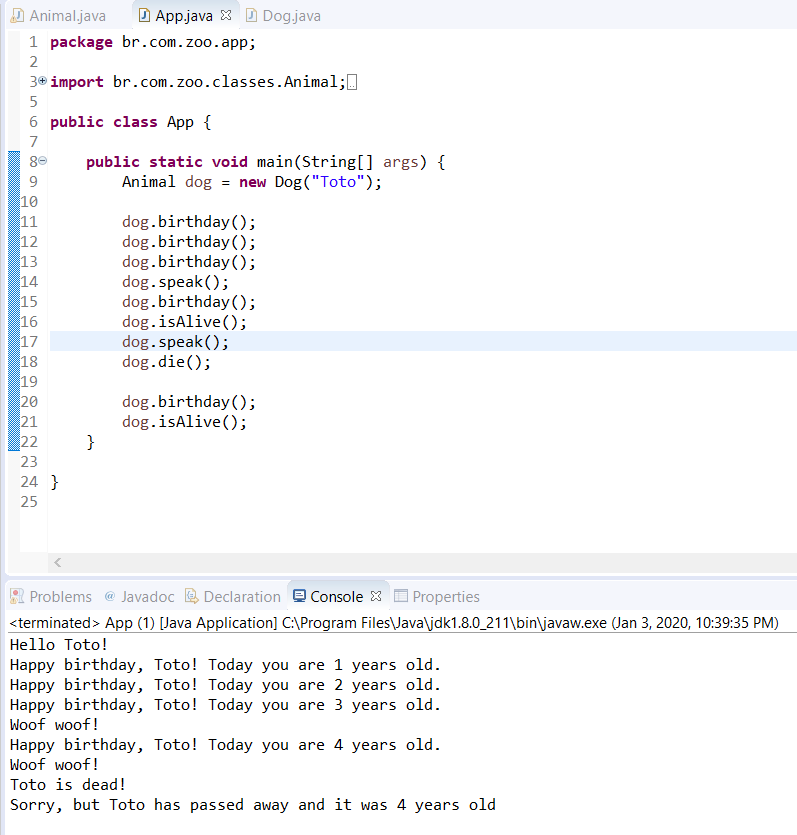

# About

This is my very first Java script. It is a kind of "Hello world!", but building my personal Zoo 😁

Here I used some concepts from OOP, such as:
 - Encapsulation;
 - Inheritance;
 - Abstraction;
 - Polimorphism.

